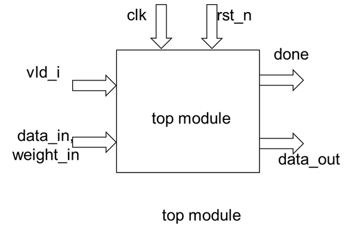
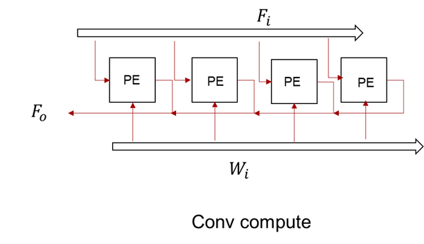
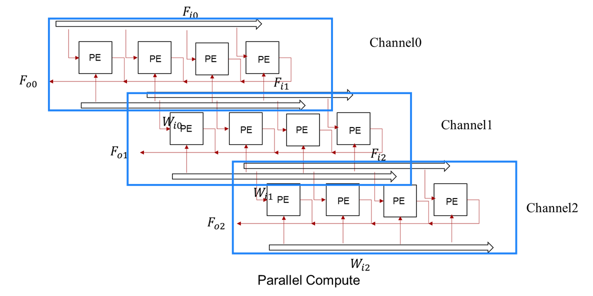
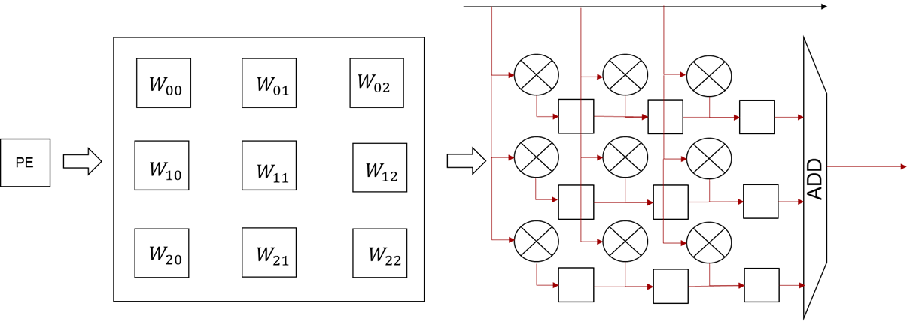
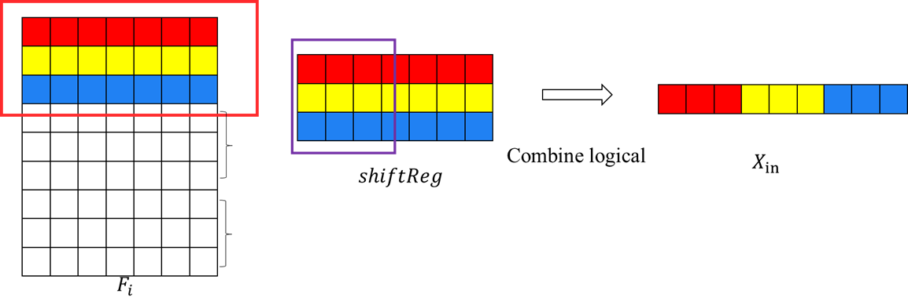
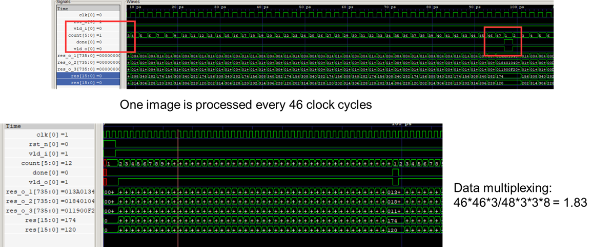
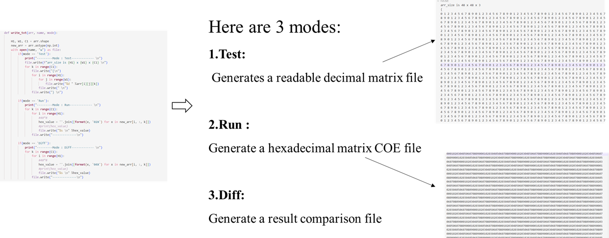
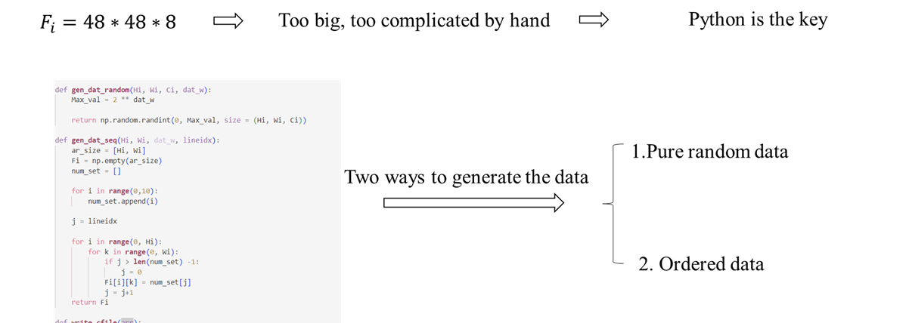
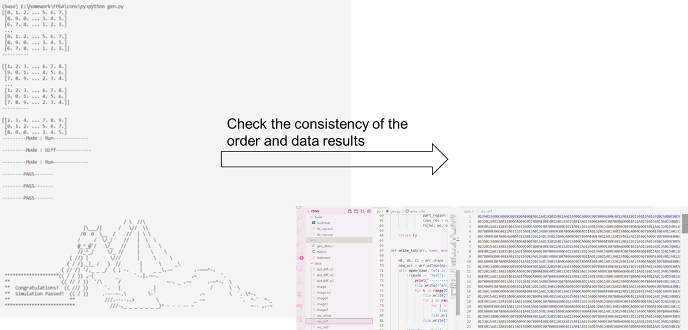

# CNN acclerate 


## 1. input && conv && output

input (uint8): 48 * 48 *3

conv  (uint8): 3 * 3 * 3

output       : 46 * 46 *3


## 2. File tree discription

1. build :
   
   run ```build.bat```     
	
	run build.bat to bulid the project and to get the vcd file checking the wave

2. c  :
   
   c project, used to check the correct of the element in array(Fi or Fo) by changing the array Fi, conv

3. data :

	store the data file (like input signals or result data and so on)

4. py :

	by run ```python gen.py ``` 
	
	get the Fi data, or conv data of coe file used by rom.

	by ```diff_test``` to check the result

5. rtl :

	Here are two files:
	1. pe.v
	2. top.v

	pe module used to simulate the conv op and just execute mulitiply operation.

	top module instant 46*3 pe modules 


6. sim:

	tb_top.sv arrange the data to flow in


## 3. detail and process

while the top module is very simple:

 


while the parallel 

 


 

 

 


 

 

 


 
